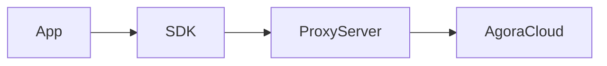
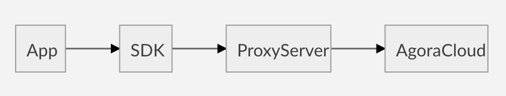
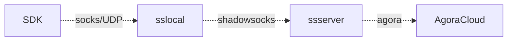
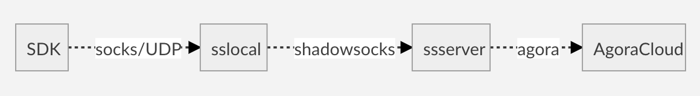

# socks-proxy

## 技术方案

* **Proxy** Socks5/UDP
* **Shadowsocks** sslocal + ssserver

## 安装脚本

* install-ubuntu.sh

## 高可用和负载均衡

* **性能测试**

* 负载很大，单个服务器无法支撑
* 单个服务器故障不可用

### DNS based Round-Robin
* Shadowsocks cluster
* Share a single domain name
* Round-Robin load balancing
* 有代理服务器故障时，更新 DNS 记录

###  Random proxy server in App
* App 从代理服务器列表中随机选择一个，设置给SDK

#### 问题
* 单个代理服务器故障时，发现故障，更新DNS等，都需要额外时间才能恢复；App随机选择到故障的代理服务器，不可用。
* App做可用性检测
* SDK自动做可用性检测，选择可用的代理服务器。SDK需要进一步开发才能支持。
